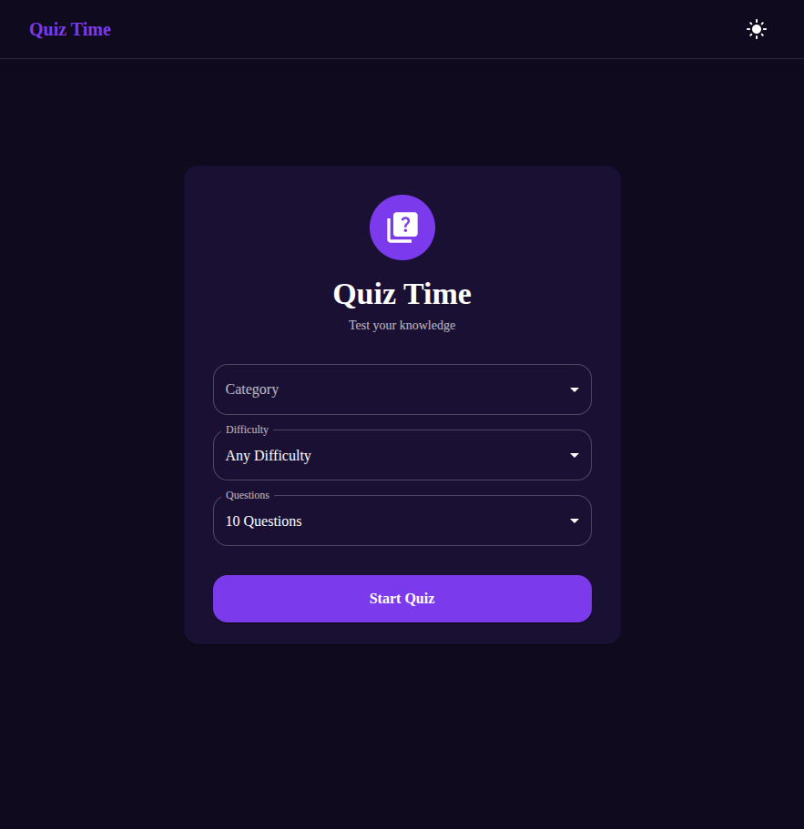
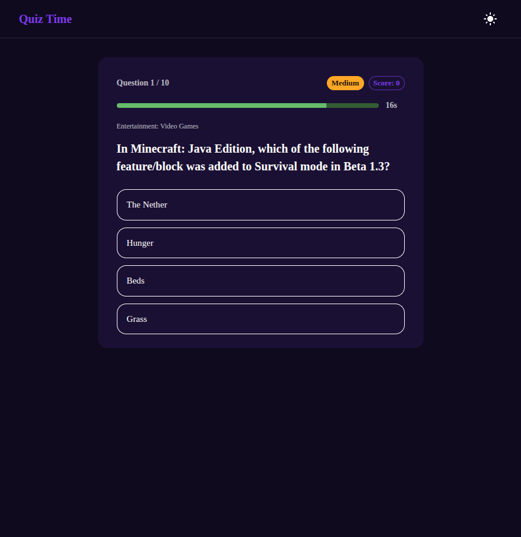
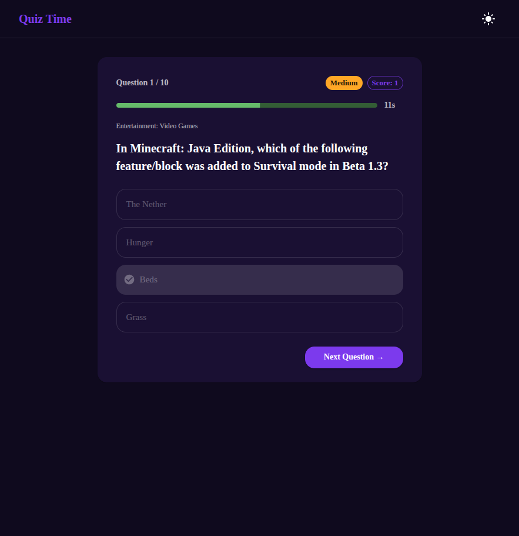

# Quiz Time

Trivia quiz app with category/difficulty selection, countdown timer, and leaderboard.

## Tech Stack

- **Framework**: Next.js 14 (App Router)
- **UI**: Material UI (MUI) v5
- **Language**: TypeScript
- **API**: Open Trivia DB (free, no key required)

## Features

- 24 categories + any difficulty (easy / medium / hard)
- 20-second countdown timer per question with color feedback
- Instant right/wrong answer reveal
- Score tracking across all questions
- Local leaderboard saved in `localStorage` (top 10)
- Share your score via Web Share API
- Dark / light mode

## Setup

```bash
git clone https://github.com/mohashari/quiz-trivia-app.git
cd quiz-trivia-app
npm install
npm run dev
```

No API key needed — Open Trivia DB is free and open.

## Screenshots

| Setup | Question | Answer Reveal |
|---|---|---|
|  |  |  |

## Live Demo

_Coming soon_

---

> Part of [mohashari's portfolio](https://github.com/mohashari) — 10 web app projects
